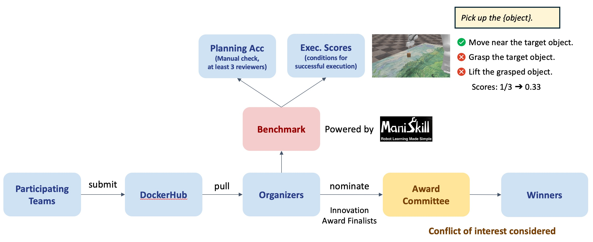

# Composable Generalization Agents Challenge

This challenge is held at [ICML 2024 WORKSHOP: Multi-modal Foundation Model meets Embodied AI](https://icml-mfm-eai.github.io).

This repository contains the benchmark toolkit and the RH20T-P data api.

### 1. Benchmark Toolkit

#### 1.1 Installation

##### Install Vulkan (e.g., on Ubuntu)

```bash
sudo apt-get install libvulkan1
```

To test your installation of Vulkan

```bash
sudo apt-get install vulkan-utils
vulkaninfo
```

If `vulkaninfo` fails to show the information about Vulkan, you can check this [page](https://maniskill.readthedocs.io/en/latest/user_guide/getting_started/installation.html#troubleshooting) for troubleshooting.

##### Install ManiSkill 3

```bash
conda create -n maniskill python=3.10
conda activate maniskill

pip install --upgrade mani_skill
pip install torch torchvision torchaudio  # make sure torch >= 2.3
```

To test your installation of ManiSkill

```bash
python -m mani_skill.examples.demo_random_action
```

##### Clone the Repo

```bash
git clone https://github.com/Zx55/cga-challenge.git
pip install -r requirements.txt
```

#### 1.2 Benchmark

We provide a simple test case (`Rh20t-PickObject-v0`) in this repository to facilitate participants in debugging their CGAs.

You can run the following command to show this test case.

```bash
python main.py --env Rh20t-PickObject-v0 --gt --seed 0
```

The argument `--gt` will sample a predefined gt trajectory to complete the task (if possible).

##### Evaluation Protocal

* Input

    * Open-world instruction (in language)
    
    * RGB image rendered by simulator (you can also store these images as historical inputs)

    * Camera information (extrinsic, intrinsic)

    * Position of end-effector

* Output

    * Actions for each step 
        
        * End-effector coordinate system
        
        * 8-d vector: position (xyz) + rotation (quat) + gripper (width)

    * (option) Execution plans in order

* Metric: We will have 2 leaderboard, one for execution scores, and the other for planning accuracy

    * Execution scores (see [here](https://github.com/Zx55/cga-challenge/blob/main/rh20tp_envs/eval_tasks/pick_object.py#L124))
        
        * We have set multiple conditions for each test case so that it can be executed successfully.

        * *E.g.*, the condition for the test case `Rh20t-PickObject-v0` is:

            * Move near the target object

            * Grasp the target object

            * Lift the grasped object

        * You can achieve corresponding score for each condition completed.

    * Planning Accuracy

        * If you do not select to output plans, you will not participate in the rankings of planning accuracy leaderboard

        * No restriction on the definition of primitive skills

        * Manual check will be conduct (at least 3 reviewers)

##### Integrate Your CGAs by Wrapper

TODO: szl

##### Test Your CGAs Locally

TODO: szl

#### 1.3 Submission

<div align="center"></div>

##### Upload to DockerHub

TODO: szl

##### Submission 

After the test server opens since [xxx], you can submit the name and tag of uploaded model image on Dockerhub.

We will pull the image on the test server, and conduct the benchmark.

\* *The page for submission will be released later.*

#### 1.4 Advance Usage

You can also collect data from simulators to fine-tune your CGAs.

You can refer to [here](https://github.com/Zx55/cga-challenge/blob/main/rh20tp_envs/eval_tasks/pick_object.py#L150) or [MotionPlanning API](https://maniskill.readthedocs.io/en/latest/user_guide/data_collection/motionplanning.html) provided by ManiSkill.

#### 1.5 Rules 

* For participation in the challenge, it is a strict requirement to register for your team by filling out the [Google Form].

* Any kind of Large Language Models (LLMs) & Multimodal Large Language Models (MLLMs) can be used in this challenge. Both open-sourced models, *e.g.*, LLaMA or LLaVA, and close-sourced models that can be accessed via network requests, *e.g.*, GPT-4, are allowed.

* Any kind of existing real-world/simulated robotic manipulation dataset can be used in this challenge.

* No restriction on definition of primitive skills. You can design any format of that, *e.g.*, natural language, code. We will check the output plans manually.

* In order to check for compliance, we will ask the participants to provide technical reports to the challenge committee and participants will be asked to provide a public talk about their works after winning the award.

### 2. RH20T-P Resources

#### 2.1 Download the Dataset

|Sources|URL|
|:---:|:---:|
|RH20T dataset|[download](https://rh20t.github.io/#download)|
|RH20T-P annotation|[download](https://drive.google.com/file/d/1ssNJikkaEYViz4yr-vIdQjmWoqiLWuwz/view?usp=sharing)|

#### 2.2 RH20T-P API

We provide the api for RH20T-P usage in `data/rh20tp/dataset.py`. See [here](data/rh20tp/README.md) for details.
